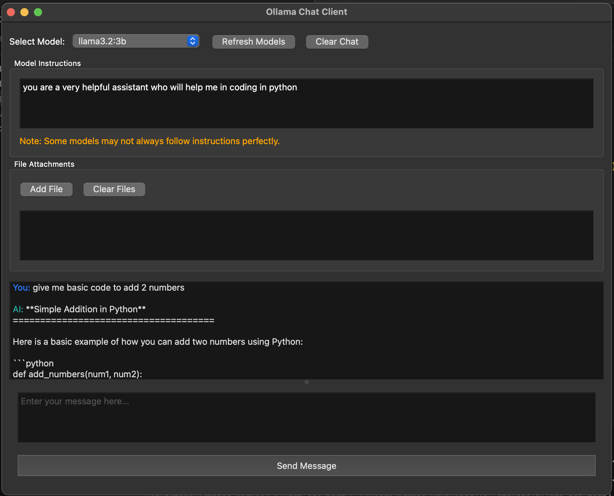

# Ollama API Client

A PyQt6-based GUI application for interacting with Ollama models through its API.

## Features

- List and select available Ollama models
- Send prompts and receive responses in a chat-like interface
- Maintain chat history for context
- Add system instructions (system prompts) to guide model behavior
- Upload and process different file types:
  - Images (PNG, JPG, JPEG, GIF, BMP, WEBP)
  - Text files (TXT)
  - PDF documents
- Clean, responsive UI with theme detection (light/dark mode support)
- Keyboard shortcuts (Enter to send, Shift+Enter for new line)

## Screenshot



## Requirements

- Python 3.12 or higher
- Ollama installed and running locally (default: http://localhost:11434)

## Installation

1. Clone this repository
2. Install the required dependencies:

```bash
pip install -r requirements.txt
```

## Usage

1. Make sure Ollama is running on your system
2. Run the application:

```bash
python ollama_client.py
```

3. Click "Refresh Models" to get the list of available models
4. Select a model from the dropdown
5. (Optional) Enter instructions in the "Model Instructions" field to guide the model
6. (Optional) Add files by clicking "Add File" and selecting supported files
7. Enter your prompt in the input area
8. Press Enter or click "Send Message" to get a response

## Keyboard Shortcuts

- **Enter**: Send message
- **Shift+Enter**: Add new line in the input field

## Notes

- This application uses the Ollama API which should be running on localhost:11434 by default
- Some models may not fully adhere to system instructions or properly process all file types
- For more information about Ollama, visit: https://github.com/ollama/ollama
